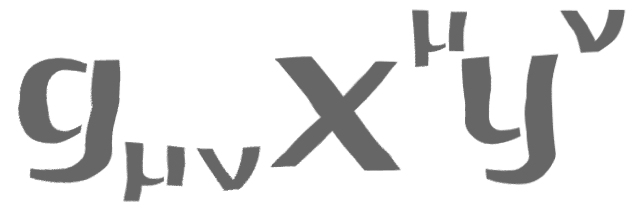

# Spatium



[](https://travis-ci.com/dyens/spatium)

Spatium -- library for comparing distance between sequences.

# Algorithms

## Edit based

- [Hamming](https://en.wikipedia.org/wiki/Hamming_distance)
- [Levenshtein](https://en.wikipedia.org/wiki/Levenshtein_distance)
- [Damerau-Levenshtein](https://en.wikipedia.org/wiki/Damerau%E2%80%93Levenshtein_distance)


## Example

For example, [Levenshtein](https://en.wikipedia.org/wiki/Levenshtein_distance):

```rust
use spatium::edit_based::levenshtein;

// Get default algorithm for calc levenshtein distance.
let alg = levenshtein::Default::default();
let x = [1, 2, 3];
let y = [1, 2, 4];
let distance = alg.distance(&x, &y).unwrap();
assert_eq!(distance, 1.0);

// With normaliztion (normalized distance = distance / x.len())
let alg = levenshtein::Default::default().normalize_result(true);
let x = [1, 2, 3];
let y = [1, 2, 4];
let distance = alg.distance(&x, &y).unwrap();
assert_eq!(distance, 1.0 / 3.0);

// Use obviously algorithm (for example recursive version)

let alg = levenshtein::Recursive::default();
let x = [1, 2, 3];
let y = [1, 2, 4];
let distance = alg.distance(&x, &y).unwrap();
assert_eq!(distance, 1.0);
```
# License

Spatium is distributed under the terms of both the MIT license and the
Apache License (Version 2.0).

See [LICENSE-APACHE](LICENSE-APACHE) and [LICENSE-MIT](LICENSE-MIT) for details.
